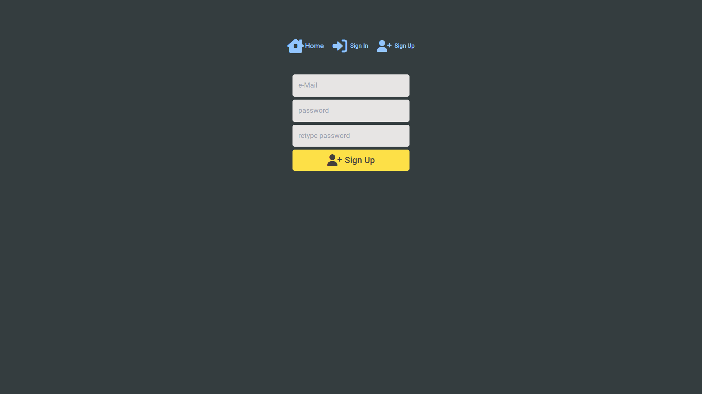

# Module#5 React Firebase Authentication WebApp


## Hosted Version of the Project:
[m5react-firebase-authentication-webapp](https://m5react-firebase-authentication-webapp.vercel.app/)

## Project Overview
In this project, i've built a secure Login Page using ReactJS with Firebase Authentication. Authentication is a crucial aspect of web applications, and by integrating Firebase, a powerful and user-friendly platform, provide users with a safe and seamless login experience. In This project i leant how to set up Firebase Authentication in a React application, handle user registration and login, and enhance the security of my web application.

## Tech. Stack Used:
+ [React](https://react.dev/)
+ [TailwindCSS](https://tailwindcss.com/)
+ [Google Firebase](https://firebase.google.com/)
+ [React Router Dom](https://reactrouter.com/en/main/start/tutorial) for providing routing functionality
+ [React Context API](https://react.dev/reference/react/useContext) for providing global state across application components

## How to install and run in yours local machine
```bash
npm install
npm run start
```
## Important 
You need to create an `.env` file in the root containing Firebase API Key and API ID.
Yours .env file should look like this
```
REACT_APP_API=Yours firebase api key
REACT_APP_ID=Yours firebase api ID
```
### How to get yours API Key & API ID
Now to get that API Key, you need to signup to [Google Firebase](console.firebase.google.com) and create new project and then crate new app,
while deploying yours app to [Vercel](https://vercel.com/) you need to specify these Enviornmnet variables inside settings.

### Why i did this?
to protect my API Key from aunthorized activity! 

## Author
[Abhishek kumar](https://www.linkedin.com/in/alex21c/), ([Geekster](https://geekster.in/) MERN Stack FS-14 Batch)


